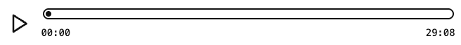

# Add Player Using Shortcodes

Every Dovetail Podcasts Player component block can be rendered using a shortcode and Wordpress's [`do_shortcode()`](https://developer.wordpress.org/reference/functions/do_shortcode/) function. See [Player Components](./player-components.md) for a complete list of shortcodes.

## Default Player

When rendering the default player layout, make sure to set the `layout` attribute to `default` on the player wrapper shortcode.

```php
echo do_shortcode( '[dovetail-podcasts-player layout="default"]' );
```

## Customize Player Controls

If you like the arrangement of controls in the default layout, but want to change what controls are used, you can set the `layout` to `flex`, and provide the shortcodes of your desired player control components inside the wrapper.

```php
// Use whatever method you like to construct your content string. Here we will just use basic string concatenation to create a content string for a simple player with a play button and time information (current time / duration).

// Start with the opening shortcode tag for the player wrapper.
$player = '[dovetail-podcasts-player display="flex"]';

// Then add player control shortcodes in the order they should appear.
$player .= '[dovetail-podcasts-player-button]';
$player .= '[dovetail-podcasts-time-display]';

// Finally, make sure to close the player wrapper shortcode.
// Note the "/" to indicate a closing tag.
$player .= '[/dovetail-podcasts-player]';

echo do_shortcode( $player );
```

When the `layout` attribute isn't provided, the player wrapper will assume any layout styling will come from the its content. This is what you will want to do for more complicated layouts.

Here is an example, placing the current time and duration below and on opposite ends of the progress bar .



```php
// Start with the opening shortcode tag for the player wrapper.
$player = '[dovetail-podcasts-player]';

// Now add your custom layout wrapper.
$player .= '<div class="my-player">';

// Play button should be the first control, but we will also give it a wrapper div.
$player .= '<div class="my-play-button">[dovetail-podcasts-play-button]</div>';

// Same with the progress bar...
$player .= '<div class="my-progress-bar">[dovetail-podcasts-progress-bar]</div>';

// ... and time info components.
$player .= '<div class="my-time-info">[dovetail-podcasts-time-current][dovetail-podcasts-time-duration]</div>';

// Be sure to close your custom layout wrapper.
$player .= '</div>';

// Finally, make sure to close the player wrapper shortcode.
// Note the "/" to indicate a closing tag.
$player .= '[/dovetail-podcasts-player]';

echo do_shortcode( $player );
```

Then you are free to style your wrappers however you need to get the layout you are looking for.

```css
.my-player {
  display: grid;
  grid-template-columns: min-content 1fr;
  grid-template-rows: 1fr 1fr;
  gap: 0.5rem;
  align-content: center;
}

.my-play-button {
  grid-row: 1 / span 2;
  display: grid;
  place-items: center;
}

.my-progress-bar {
  display: grid;
  align-items: center;
}

.my-time-info {
  display: flex;
  justify-content: space-between;
}
```
