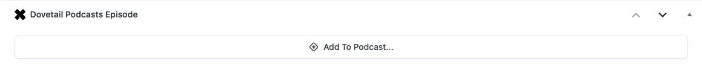
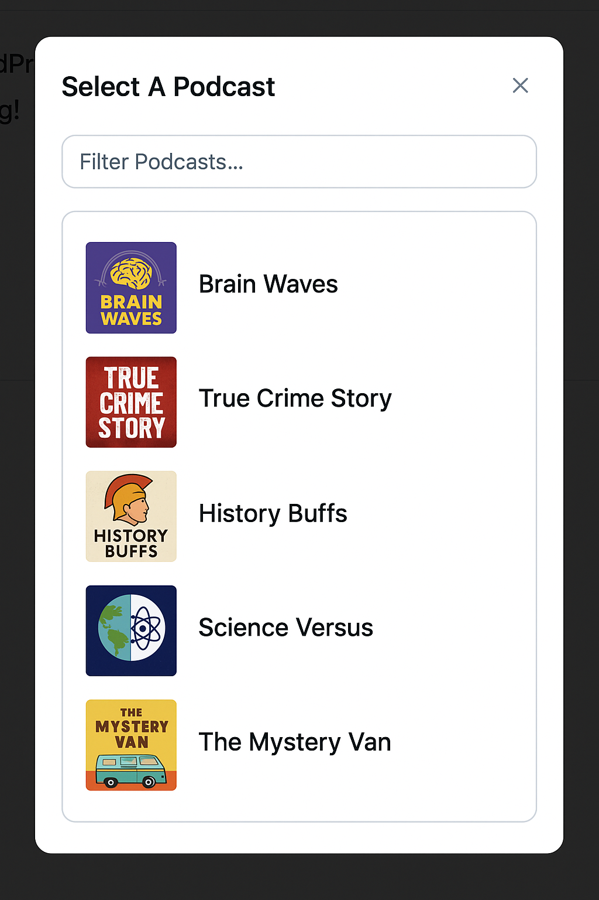
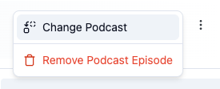
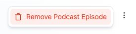

# Publish Podcast Episodes With Posts

Dovetail Podcasts will turn you posts into podcast episodes in Dovetail. Simply create and edit them as you would any other post. The post title, body, and feature image will be used as the podcast episode's title description, and thumbnail image. Any Wordpress categories or tags added to the post will be set as categories on the episode in Dovetail.

Syncing of changes to episode attributes is one-directional, from Wordpress to Dovetail. Changes in Dovetail will be overwritten by changes in Wordpress. Dovetail will have more episode attributes to edit than Wordpress. Those not editable in Wordpress will not be affected.

## Adding Episode To A Podcast

Look for the Dovetail Podcasts Episode box when editing a post to start.

Click the **Add To Podcast** button and select a podcast from the dialog.

Now you can add your audio, either by clicking the upload button or pasting in a URL. Fill in any additional episode information you need. When you are done, save your post.

If your post is a draft, the episode will be created as a draft in Dovetail. The audio will then be retrieved by Dovetail and processed to prepare it to go into your distribution feeds.

> Oops! Did you add the episode to the wrong podcast. As long as the episode has not been published, you can change the podcast by clicking the **Content Menu** button, and selecting **Change Podcast**.
>
> 
>
> When you save the draft, the draft episode in Dovetail will be moved to the selected podcast.

### Publishing The Episode

Publishing the post will immediately publish the episode in Dovetail. Easy.

#### Schedule Episode To Be Published

Set a future publish date on your post and publish it. The Dovetail episode will be scheduled to publish itself on the same date.

### Remove Podcast Episode

If you added the podcast episode to the wrong post or just want to remove the episode, click the **Content Menu** button, and selecting **Remove Podcast Episode**.

After confirming the dialog and saving the post, episode data will be removed from the post and the episode will be deleted from Dovetail. If you decide not to remove the episode, click **Keep Dovetail Episode** in the alert BEFORE saving the post.

#### Deleting The Post

Deleting the post will delete the episode in Dovetail. If the post type you are using for podcast episodes supports Wordpress's trash feature, the Dovetail episode will be unpublished and remain a draft episode until the post is either remove or restored from the trash. Restoring the post will result in Dovetail republishing the episode. Removing the post from the trash will delete the episode in Dovetail.
