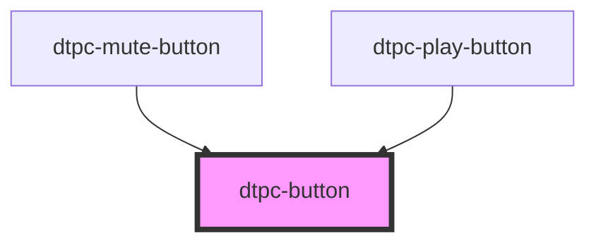

# dtpc-button

<!-- Auto Generated Below -->

## Dependencies

### Used by

 - [dtpc-mute-button](../dtpc-mute-button)
 - [dtpc-play-button](../dtpc-play-button)

### Graph

----------------------------------------------

*Built with [StencilJS](https://stenciljs.com/)*
