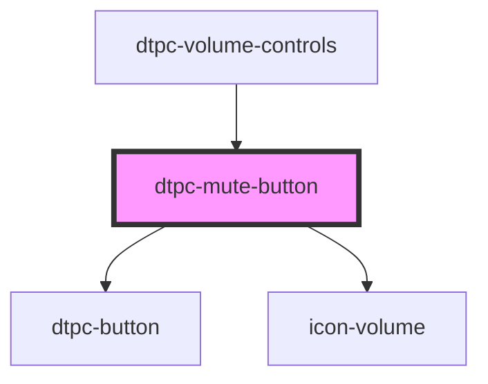

# dtpc-mute-button

<!-- Auto Generated Below -->

## Events

| Event               | Description | Type               |
| ------------------- | ----------- | ------------------ |
| `dtpc-control-init` |             | `CustomEvent<any>` |

## Dependencies

### Used by

 - [dtpc-volume-controls](../dtpc-volume-controls)

### Depends on

- [dtpc-button](../dtpc-button)
- [icon-volume](../icons)

### Graph

----------------------------------------------

*Built with [StencilJS](https://stenciljs.com/)*
