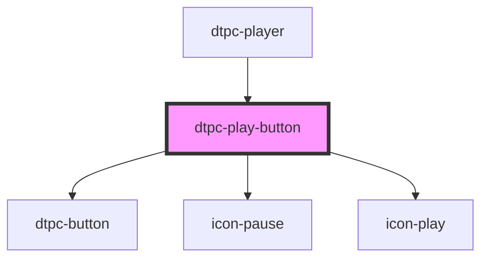

# dtpc-play-button

<!-- Auto Generated Below -->

## Events

| Event                 | Description | Type               |
| --------------------- | ----------- | ------------------ |
| `audio-toggle-paused` |             | `CustomEvent<any>` |
| `dtpc-control-init`   |             | `CustomEvent<any>` |

## Dependencies

### Used by

 - [dtpc-player](../dtpc-player)

### Depends on

- [dtpc-button](../dtpc-button)
- [icon-pause](../icons)
- [icon-play](../icons)

### Graph

----------------------------------------------

*Built with [StencilJS](https://stenciljs.com/)*
