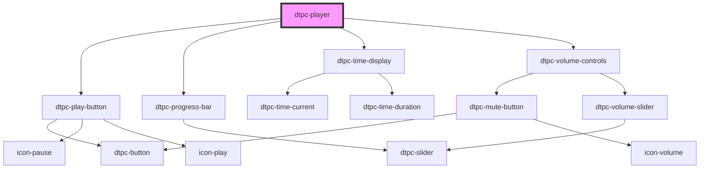

# dtpc-player

<!-- Auto Generated Below -->

## Properties

| Property   | Attribute  | Description                                                                                                                                                                                                     | Type                  | Default     |
| ---------- | ---------- | --------------------------------------------------------------------------------------------------------------------------------------------------------------------------------------------------------------- | --------------------- | ----------- |
| `duration` | `duration` | Preset audio source duration.                                                                                                                                                                                   | `number`              | `0`         |
| `layout`   | `layout`   | Predefined layouts. - 'flex': Adds `display: flex` to main container. - 'default': Renders player with basic controls. (Play button, progress bar, time display, volume controls) - TODO: More options to come. | `"default" \| "flex"` | `undefined` |
| `src`      | `src`      | Audio source URL.                                                                                                                                                                                               | `string`              | `undefined` |

## Shadow Parts

| Part         | Description |
| ------------ | ----------- |
| `"backdrop"` |             |

## Dependencies

### Depends on

- [dtpc-play-button](../dtpc-play-button)
- [dtpc-progress-bar](../dtpc-progress-bar)
- [dtpc-time-display](../dtpc-time-display)
- [dtpc-volume-controls](../dtpc-volume-controls)

### Graph

----------------------------------------------

*Built with [StencilJS](https://stenciljs.com/)*
