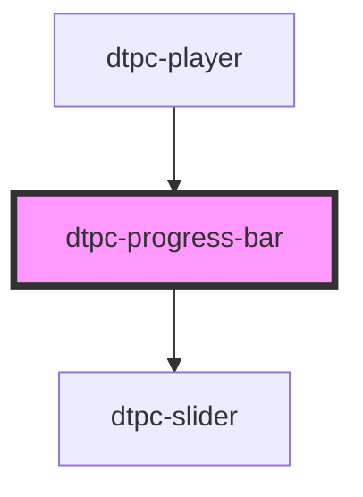

# dtpc-progress-bar

<!-- Auto Generated Below -->

## Properties

| Property   | Attribute  | Description | Type     | Default |
| ---------- | ---------- | ----------- | -------- | ------- |
| `duration` | `duration` |             | `number` | `0`     |

## Events

| Event               | Description | Type               |
| ------------------- | ----------- | ------------------ |
| `dtpc-control-init` |             | `CustomEvent<any>` |

## Dependencies

### Used by

 - [dtpc-player](../dtpc-player)

### Depends on

- [dtpc-slider](../dtpc-slider)

### Graph

----------------------------------------------

*Built with [StencilJS](https://stenciljs.com/)*
