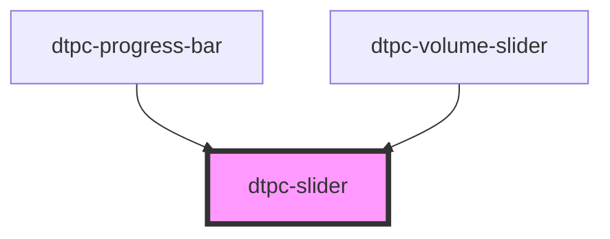

# dtpc-slider

<!-- Auto Generated Below -->

## Properties

| Property       | Attribute       | Description | Type                         | Default     |
| -------------- | --------------- | ----------- | ---------------------------- | ----------- |
| `defaultValue` | `default-value` |             | `number`                     | `0`         |
| `disabled`     | `disabled`      |             | `boolean`                    | `false`     |
| `max`          | `max`           |             | `number`                     | `100`       |
| `min`          | `min`           |             | `number`                     | `0`         |
| `orient`       | `orient`        |             | `"horizontal" \| "vertical"` | `undefined` |
| `step`         | `step`          |             | `number`                     | `1`         |
| `value`        | `value`         |             | `number`                     | `null`      |

## Events

| Event           | Description | Type                  |
| --------------- | ----------- | --------------------- |
| `slider-change` |             | `CustomEvent<number>` |
| `slider-input`  |             | `CustomEvent<number>` |

## Dependencies

### Used by

 - [dtpc-progress-bar](../dtpc-progress-bar)
 - [dtpc-volume-slider](../dtpc-volume-slider)

### Graph

----------------------------------------------

*Built with [StencilJS](https://stenciljs.com/)*
