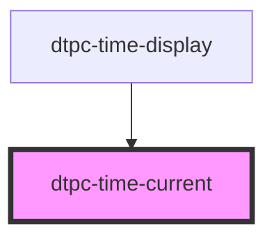

# dtpc-time-current

<!-- Auto Generated Below -->

## Events

| Event               | Description | Type               |
| ------------------- | ----------- | ------------------ |
| `dtpc-control-init` |             | `CustomEvent<any>` |

## Dependencies

### Used by

 - [dtpc-time-display](../dtpc-time-display)

### Graph

----------------------------------------------

*Built with [StencilJS](https://stenciljs.com/)*
