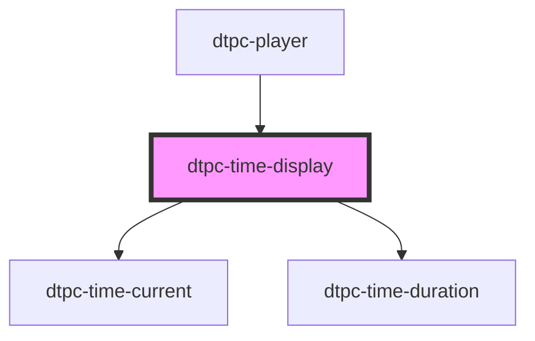

# dtpc-time-display

<!-- Auto Generated Below -->

## Properties

| Property   | Attribute  | Description | Type     | Default |
| ---------- | ---------- | ----------- | -------- | ------- |
| `duration` | `duration` |             | `number` | `0`     |

## Dependencies

### Used by

 - [dtpc-player](../dtpc-player)

### Depends on

- [dtpc-time-current](../dtpc-time-current)
- [dtpc-time-duration](../dtpc-time-duration)

### Graph

----------------------------------------------

*Built with [StencilJS](https://stenciljs.com/)*
