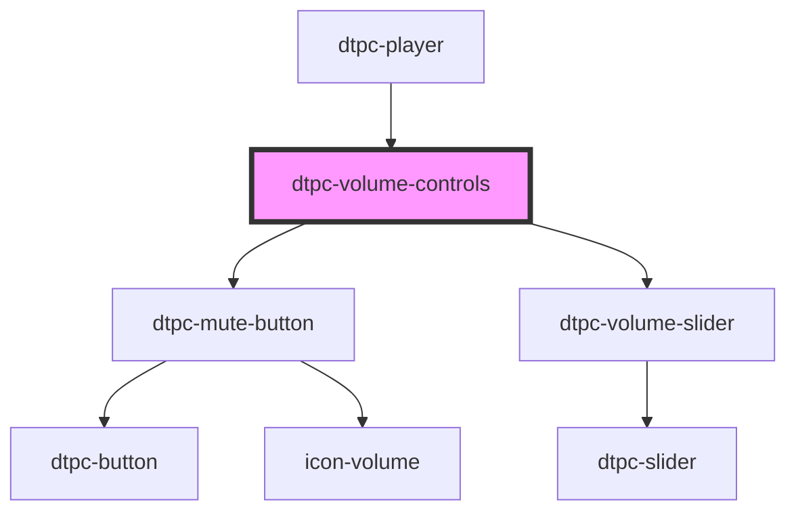

# dtpc-volume-controls

<!-- Auto Generated Below -->

## Properties

| Property | Attribute | Description | Type     | Default |
| -------- | --------- | ----------- | -------- | ------- |
| `volume` | `volume`  |             | `number` | `0.8`   |

## Dependencies

### Used by

- [dtpc-player](../dtpc-player)

### Depends on

- [dtpc-mute-button](../dtpc-mute-button)
- [dtpc-volume-slider](../dtpc-volume-slider)

### Graph

---

_Built with [StencilJS](https://stenciljs.com/)_
