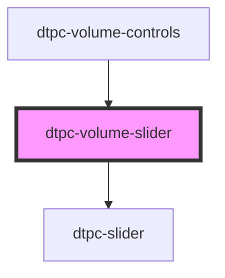

# dtpc-volume-slider

<!-- Auto Generated Below -->

## Properties

| Property | Attribute | Description | Type                         | Default     |
| -------- | --------- | ----------- | ---------------------------- | ----------- |
| `orient` | `orient`  |             | `"horizontal" \| "vertical"` | `undefined` |
| `volume` | `volume`  |             | `number`                     | `0.8`       |

## Events

| Event               | Description | Type               |
| ------------------- | ----------- | ------------------ |
| `dtpc-control-init` |             | `CustomEvent<any>` |

## Dependencies

### Used by

 - [dtpc-volume-controls](../dtpc-volume-controls)

### Depends on

- [dtpc-slider](../dtpc-slider)

### Graph

----------------------------------------------

*Built with [StencilJS](https://stenciljs.com/)*
