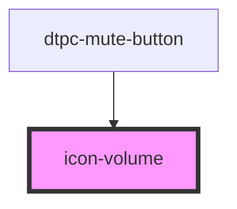

# icon-volume

<!-- Auto Generated Below -->

## Properties

| Property                    | Attribute                     | Description | Type      | Default     |
| --------------------------- | ----------------------------- | ----------- | --------- | ----------- |
| `alignmentBaseline`         | `alignment-baseline`          |             | `any`     | `undefined` |
| `baselineShift`             | `baseline-shift`              |             | `any`     | `undefined` |
| `clipPath`                  | `clip-path`                   |             | `any`     | `undefined` |
| `clipRule`                  | `clip-rule`                   |             | `any`     | `undefined` |
| `color`                     | `color`                       |             | `any`     | `undefined` |
| `colorInterpolation`        | `color-interpolation`         |             | `any`     | `undefined` |
| `colorInterpolationFilters` | `color-interpolation-filters` |             | `any`     | `undefined` |
| `colorRendering`            | `color-rendering`             |             | `any`     | `undefined` |
| `cursor`                    | `cursor`                      |             | `any`     | `undefined` |
| `cx`                        | `cx`                          |             | `any`     | `undefined` |
| `cy`                        | `cy`                          |             | `any`     | `undefined` |
| `d`                         | `d`                           |             | `any`     | `undefined` |
| `direction`                 | `direction`                   |             | `any`     | `undefined` |
| `display`                   | `display`                     |             | `any`     | `undefined` |
| `dominantBaseline`          | `dominant-baseline`           |             | `any`     | `undefined` |
| `fill`                      | `fill`                        |             | `any`     | `undefined` |
| `fillOpacity`               | `fill-opacity`                |             | `any`     | `undefined` |
| `fillRule`                  | `fill-rule`                   |             | `any`     | `undefined` |
| `filter`                    | `filter`                      |             | `any`     | `undefined` |
| `floodColor`                | `flood-color`                 |             | `any`     | `undefined` |
| `floodOpacity`              | `flood-opacity`               |             | `any`     | `undefined` |
| `font`                      | `font`                        |             | `any`     | `undefined` |
| `fontFamily`                | `font-family`                 |             | `any`     | `undefined` |
| `fontKerning`               | `font-kerning`                |             | `any`     | `undefined` |
| `fontSize`                  | `font-size`                   |             | `any`     | `undefined` |
| `fontSizeAdjust`            | `font-size-adjust`            |             | `any`     | `undefined` |
| `fontStretch`               | `font-stretch`                |             | `any`     | `undefined` |
| `fontStyle`                 | `font-style`                  |             | `any`     | `undefined` |
| `fontVariant`               | `font-variant`                |             | `any`     | `undefined` |
| `fontWeight`                | `font-weight`                 |             | `any`     | `undefined` |
| `height`                    | `height`                      |             | `any`     | `undefined` |
| `imageRendering`            | `image-rendering`             |             | `any`     | `undefined` |
| `isolation`                 | `isolation`                   |             | `any`     | `undefined` |
| `letterSpacing`             | `letter-spacing`              |             | `any`     | `undefined` |
| `lightingColor`             | `lighting-color`              |             | `any`     | `undefined` |
| `marker`                    | `marker`                      |             | `any`     | `undefined` |
| `markerEnd`                 | `marker-end`                  |             | `any`     | `undefined` |
| `markerMid`                 | `marker-mid`                  |             | `any`     | `undefined` |
| `markerStart`               | `marker-start`                |             | `any`     | `undefined` |
| `mask`                      | `mask`                        |             | `any`     | `undefined` |
| `maskClip`                  | `mask-clip`                   |             | `any`     | `undefined` |
| `maskComposite`             | `mask-composite`              |             | `any`     | `undefined` |
| `maskImage`                 | `mask-image`                  |             | `any`     | `undefined` |
| `maskMode`                  | `mask-mode`                   |             | `any`     | `undefined` |
| `maskOrigin`                | `mask-origin`                 |             | `any`     | `undefined` |
| `maskPosition`              | `mask-position`               |             | `any`     | `undefined` |
| `maskRepeat`                | `mask-repeat`                 |             | `any`     | `undefined` |
| `maskSize`                  | `mask-size`                   |             | `any`     | `undefined` |
| `maskType`                  | `mask-type`                   |             | `any`     | `undefined` |
| `muted`                     | `muted`                       |             | `boolean` | `false`     |
| `opacity`                   | `opacity`                     |             | `any`     | `undefined` |
| `overflow`                  | `overflow`                    |             | `any`     | `undefined` |
| `pointerEvents`             | `pointer-events`              |             | `any`     | `undefined` |
| `r`                         | `r`                           |             | `any`     | `undefined` |
| `rx`                        | `rx`                          |             | `any`     | `undefined` |
| `ry`                        | `ry`                          |             | `any`     | `undefined` |
| `shapeRendering`            | `shape-rendering`             |             | `any`     | `undefined` |
| `stopColor`                 | `stop-color`                  |             | `any`     | `undefined` |
| `stopOpacity`               | `stop-opacity`                |             | `any`     | `undefined` |
| `stroke`                    | `stroke`                      |             | `any`     | `undefined` |
| `strokeDasharray`           | `stroke-dasharray`            |             | `any`     | `undefined` |
| `strokeDashoffset`          | `stroke-dashoffset`           |             | `any`     | `undefined` |
| `strokeLinecap`             | `stroke-linecap`              |             | `any`     | `undefined` |
| `strokeLinejoin`            | `stroke-linejoin`             |             | `any`     | `undefined` |
| `strokeMiterlimit`          | `stroke-miterlimit`           |             | `any`     | `undefined` |
| `strokeOpacity`             | `stroke-opacity`              |             | `any`     | `undefined` |
| `strokeWidth`               | `stroke-width`                |             | `any`     | `undefined` |
| `textAnchor`                | `text-anchor`                 |             | `any`     | `undefined` |
| `textDecoration`            | `text-decoration`             |             | `any`     | `undefined` |
| `textOrientation`           | `text-orientation`            |             | `any`     | `undefined` |
| `textRendering`             | `text-rendering`              |             | `any`     | `undefined` |
| `transform`                 | `transform`                   |             | `any`     | `undefined` |
| `transformBox`              | `transform-box`               |             | `any`     | `undefined` |
| `transformOrigin`           | `transform-origin`            |             | `any`     | `undefined` |
| `unicodeBidi`               | `unicode-bidi`                |             | `any`     | `undefined` |
| `visibility`                | `visibility`                  |             | `any`     | `undefined` |
| `volume`                    | `level`                       |             | `number`  | `0.8`       |
| `width`                     | `width`                       |             | `any`     | `undefined` |
| `wordSpacing`               | `word-spacing`                |             | `any`     | `undefined` |
| `writingMode`               | `writing-mode`                |             | `any`     | `undefined` |
| `x`                         | `x`                           |             | `any`     | `undefined` |
| `y`                         | `y`                           |             | `any`     | `undefined` |

## Dependencies

### Used by

 - [dtpc-mute-button](../dtpc-mute-button)

### Graph

----------------------------------------------

*Built with [StencilJS](https://stenciljs.com/)*
